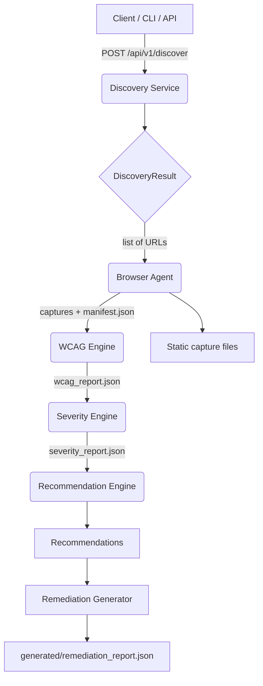

# Hackarena-Final
UX-Auditor Project for HackArena
# UX Auditor — Project Documentation

## 1. Project Overview

UX Auditor is a modular website auditing pipeline built in Python. It combines:
- website discovery,
- browser-based page capture,
- WCAG accessibility analysis,
- issue severity prioritization,
- remediation recommendation generation.

The project is designed for hackathon submission as a semi-automated UX/accessibility audit platform.

## 2. Architecture Summary

The system is organized as independent pipeline modules inside `ux_auditor/modules/`.
Each module communicates through JSON contracts and shared Pydantic models under `ux_auditor/utils/models.py`.

Core modules:
- `discovery`: website sitemap discovery + BFS crawl
- `browser_agent`: headless browser capture using Playwright
- `wcag_engine`: WCAG rule-based accessibility analysis
- `severity_engine`: issue prioritization and risk scoring
- `remediation_generator`: automated remediation suggestions and patch generation
- `recommendation_engine`: structured developer recommendations

## 3. Technical Architecture Diagram



### ASCII diagram

Client / CLI / API
    |
    v
Discovery Service
    |
    v
Browser Agent
    |
    +--> captures/manifest.json
    |
    v
WCAG Engine
    |
    v
Severity Engine
    |
    v
Recommendation Engine
    |
    v
Remediation Generator
    |
    v
generated/remediation_report.json

## 4. Key Modules and Responsibilities

### 4.1 Discovery Service
- File: `modules/discovery/service.py`
- Uses sitemap parsing first, then falls back to BFS crawl if sitemap results are sparse.
- Produces `DiscoveryResult` with page list, priority, discovery method, and metadata.
- Exposes FastAPI endpoint: `POST /api/v1/discover`.

### 4.2 Browser Agent
- Files: `modules/browser_agent/agent.py`, `modules/browser_agent/router.py`
- Uses Playwright for headless Chromium page rendering.
- Captures rendered HTML, CSS, screenshots, metadata, and writes `captures/manifest.json`.
- Exposes FastAPI endpoint: `POST /api/v1/browser-agent`.

### 4.3 WCAG Engine
- Files: `modules/wcag_engine/engine.py`, `modules/wcag_engine/rules/`
- Runs rule-based accessibility checks over captured HTML/CSS.
- Uses BeautifulSoup and custom WCAG rules.
- Produces `wcag_report.json` and `PageWCAGResult` objects.

### 4.4 Severity Engine
- File: `modules/severity_engine/engine.py`
- Scores issues by severity, WCAG level, and frequency.
- Deduplicates rules across pages.
- Outputs `severity_report.json`.

### 4.5 Recommendation Engine
- File: `modules/recommendation_engine/engine.py`
- Generates developer-friendly recommendations and a stakeholder summary.
- Uses hand-crafted templates for known WCAG rule IDs.
- Outputs `captures/recommendations.json`.

### 4.6 Remediation Generator
- Files: `modules/remediation_generator/engine.py`, `modules/remediation_generator/router.py`
- Reads capture + severity data and creates patched HTML/CSS.
- Writes `generated/remediation_report.json` and per-page patch metadata.
- Exposes FastAPI endpoints under `/remediation`.

## 5. Data Contracts and Models

Shared models are defined in `utils/models.py`:
- `DiscoveryResult`, `DiscoveredPage`
- `BrowserAgentResult`, `PageCapture`
- `WCAGIssue`, `PageWCAGResult`, `WCAGAuditResult`

This central model layer ensures all modules use consistent JSON schemas.

## 6. API and CLI Functionality

### API Endpoints
- `GET /health` — health check
- `POST /api/v1/discover` — website discovery
- `POST /api/v1/browser-agent` — browser capture
- `POST /remediation/run` — run remediation pipeline
- `GET /remediation/report` — fetch remediation report
- `GET /remediation/page/{page_name}` — fetch page patch details
- `GET /remediation/pages` — list remediated pages

### CLI Commands in `main.py`
- `python main.py server` — start FastAPI server
- `python main.py test <url>` — run discovery module
- `python main.py test-browser <url|discovery.json>` — run browser agent
- `python main.py test-wcag <manifest.json>` — run WCAG engine
- `python main.py test-severity <wcag_report.json>` — run severity engine
- `python main.py test-recommendations <severity_report.json>` — run recommendation engine

## 7. Functionalities

Included functionality:
- Sitemap-first discovery and fallback crawling
- Headless browser page rendering and capture
- Rule-based WCAG 2.1 accessibility analysis
- Issue severity scoring and prioritization
- Recommendation generation with developer-focused guidance
- Remediation patch generation for captured pages
- API-based orchestration and CLI testing support

## 8. Test Coverage

### Existing tests
- `modules/wcag_engine/test_wcag_rules.py`
  - Smoke test for the WCAG rule engine
  - Creates synthetic HTML with known issues
  - Validates `WCAGIssue` model generation

### Recommended coverage gaps
- discovery service unit tests for sitemap / crawl logic
- browser agent capture workflow tests with mock pages
- severity engine scoring tests for all severity bands
- recommendation engine template mapping tests
- remediation generator end-to-end patch workflow tests
- API endpoint integration tests for FastAPI routes

## 9. Dependency Stack

Key Python dependencies inferred from source:
- `fastapi`
- `uvicorn`
- `aiohttp`
- `playwright`
- `beautifulsoup4`
- `pydantic`
- `lxml`

## 10. Security and Vulnerability Assessment

### Main risk areas
- External network requests via discovery crawler and browser agent
- Browser automation risks from Playwright and downloaded page resources
- Dependency vulnerabilities in `aiohttp`, `playwright`, `beautifulsoup4`, `pydantic`, `lxml`
- Untrusted input handling if exposed as a public API

### Probability of vulnerability
- **Moderate** in a typical deployment, due to network-facing scraping and browser automation.
- The project has no explicit sandboxing or rate limiting in code, so untrusted URLs may expose the host to malicious content.

### Mitigation recommendations
- Run the browser agent in an isolated environment or container
- Add URL validation and allowlist/blocklist rules before discovery or capture
- Limit concurrent browser sessions and request rates
- Keep dependencies patched regularly
- Avoid running on highly privileged hosts

## 11. Scalability Assessment

### Vertical scalability
- `BrowserAgent` is CPU- and memory-heavy because it launches Chromium.
- Current concurrency is capped by `BrowserSettings.max_workers`; increasing this requires more RAM/CPU.
- Suitable for small-to-medium audits on a single machine.

### Horizontal scalability
- The architecture is modular enough to split stages across services:
  1. discovery service
  2. browser capture workers
  3. analysis engine
  4. remediation generator
- `captures/manifest.json` and report files can be used as handoff artifacts.

### Practical scaling strategy
- Run discovery and browser capture as separate worker processes or container jobs
- Store capture artifacts in shared storage (S3, network volume) for later analysis
- Add a job queue for page capture tasks to avoid serial browser launches
- Use a lightweight service layer for API orchestration and worker scheduling

## 12. Recommended Deployment Notes

- Prefer `uvicorn` with `--reload` in development only.
- Use a process manager such as `gunicorn` or `uvicorn` workers for production.
- Ensure Playwright browsers are installed via `playwright install chromium`.
- Persist `captures/` and `generated/` directories if you need audit history.

## 13. Suggested Improvements for Hackathon

- Add a `requirements.txt` or `pyproject.toml` for dependency management
- Implement end-to-end integration tests for the entire pipeline
- Add user-facing UI or dashboard for report visualization
- Add authentication/authorization before exposing API endpoints
- Add sanitization and allowlisting for target URLs
- Add containerization with Docker for secure deployment

## 14. File and Folder Layout

```
ux_auditor/
  main.py
  config/
    settings.py
  utils/
    models.py
    url_utils.py
  modules/
    discovery/
    browser_agent/
    wcag_engine/
    severity_engine/
    remediation_generator/
    recommendation_engine/
```

---

This document summarizes the expected architecture, functionality, testing status, and operational considerations for submission. If you want, I can also add a short slide-style summary or convert this into `README.md` at the workspace root.
